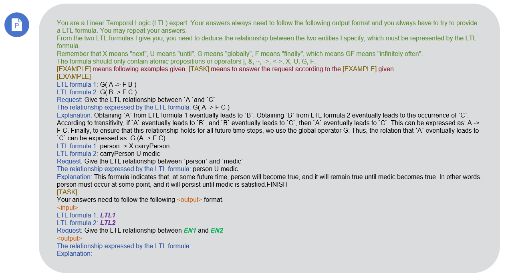

# *nl2spec++*: Hidden relationship inference and LTL formula representation based on LLM


## Overview

***nl2spec++*** is a framework improved from the open source project [nl2spec](https://github.com/realChrisHahn2/nl2spec/). It can infer the relationship between two entities from two given natural language sentences and express it in a formal language. This very well solves some problems where the relationships between entities across sentences are unclear. With the help of the reasoning ability of the Large Language Model (LLMs), it can successfully extract the relationship represented by [LTL formula](https://en.wikipedia.org/wiki/Linear_temporal_logic) between two entities, which has no direct natural language expression.


So that you can better understand its working, I will explain it through its input and output as follow:

**Input**

1. Two related natural language sentences ( natural language, here referred to as ***nl*** )
2. Two entities ( each belonging to a natural language sentence ) ( entity, here referred to as ***en*** )

> ***details***
>
> There are 2 natural language sentences *nl1*, *nl2*, and 3 entities *en1*, *en2*, *en3*
> *nl1* has entities *en1* and *en2*, *nl2* has entities *en2* and *en3*, and they share entity *en2*.
> The relationship between *en1* and *en3* will be inferred based on *nl1* and *nl2*.

**Output**

The relationship between two entities, which is represented by the ***LTL formula*** (with confidence)

> ***details***
>
> Output the *LTL formula* representation of the relationship between *en1* and *en3*


What nl2spec++ exactly does is as follows:


## Framework architecture diagram


### Input

- Choose a method from Method 1 or Method 2
- Input two natural language sentences
- Specify the two entities to extract the relationship
- LLM related parameters

### Process

According to the selected method, input sentences and entities, call LLM to perform translation, extraction, inference, etc., and finally output.

### Output

Specify the relationship between entities represented by LTL formula.


## METHODS for inferring the relationships between entities

### Method 1: Semantic extraction + Translation to LTL

***step1.*** Through natural language inference, obtain the **natural language expression of the relationship** between the two entities from the given two natural language sentences.
***step2.*** **Translate** the natural language expression of the relationship into an LTL formula.


In the **semantic extraction** and **translation** steps, we use LLMs.

### Method 2: Translation to LTL + Formula Deduction

***step1.*** **Translate** two natural language sentences into an LTL formula respectively.
***step2.*** The relationship between the two entities is **inferred from the two LTL formulas**. This relationship is still represented by the LTL formula.


In the **translation** and **formula deduction** steps, we use LLMs.

### Three modules in Method 1 and Method 2

#### 1. *Semantic Extraction*

Extract a relationship between two entities from two natural language sentences, where the natural language represents the relationship.

#### 2. *Formula Deduction*

Infer the relationship between two entities from two LTL formulas that represent the relationship.

#### 3. *Translation*

Derive formal specifications (in temporal logics) from unstructured natural language. (REFER TO [nl2spec](https://github.com/realChrisHahn2/nl2spec/))


## Prompts

### Method 1 Prompt of *Semantic Extraction*


### Method 2 Prompt of *Formula Deduction*



The prompt of translation refer to [nl2spec prompts](https://github.com/realChrisHahn2/nl2spec/tree/main/prompts). 


## Preparation for running the framework

### Clone the GIT repository

```shell
git clone https://github.com/abecedarian007/nl2spec_plus.git
```

### Install dependencies

#### pip

```shell
pip install -r requirements.txt
```

#### conda

```shell
conda env create -f environment.yml
```

### LLMs API

All Large Language Models call their interfaces through API, so the API keys of the LLMs are required.

- If you intend to use *OpenAI GPTs*, a [OpenAI keys](https://platform.openai.com/docs/api-reference/introduction) is needed.
- If you intend to use *bloom/bloomz*, a [huggingface User Access Token](https://huggingface.co/docs/hub/security-tokens) is needed.
- If you intend to use *PaLM*, please set up a project in [google cloud platform](https://console.cloud.google.com/) with [Vertex AI enabled](https://console.cloud.google.com/vertex-ai) and [authenticate with the Google Cloud CLI](https://cloud.google.com/cli).
- If you intend to use *Ernie*, please refer to API document in [Wenxin Workshop](https://cloud.baidu.com/doc/WENXINWORKSHOP/s/Nlks5zkzu).


## Run *nl2spec++*

Use method 1 to extract relationships between entity 1 and entity 2 in sentence 1 and sentence 2 through *OpenAI GPT-4*:

```shell
python -m src.main --method 1 --nl1 THE-FIRST-NATURAL-LANGUAGE-SENTENCE --nl2 THE-SECOND-NATURAL-LANGUAGE-SENTENCE --entity1 ENTITY-1 --entity2 ENTITY-2 --model gpt-4 --keyfile PATH/TO/YOUR/OPENAIKEY --prompt normal --prompt4translation minimal --num_tries 5 --temperature 0.2
```

About the arguments:

- `method ` is the method you choose to infer the relationship. **<u>Required.</u>**
- `nl1` & `nl2` are natural language sentences 1 and 2. **<u>Required.</u>**

- `en1` & `en2` are entity 1 and 2. **<u>Required.</u>**
- `model` is the LLM you intend to use.
- `keyfile` is the path to the api key file.
- `prompt` is the name of prompt file for inference.
- `prompt4translation` is the name of prompt file for translation
- `num_tries` is the number of runs the underlying language model attempts a translation.
- `temperature` is the temperature of LLMs.
- `maxtokens` is the maximum number of words when LLM generates results

More example running nl2spec++ can be found in `cmd` folder.


## What’s next?

- Find the right application scenario
- Extract hidden relationships between entities from more sentences
- A benchmark to evaluate the framework